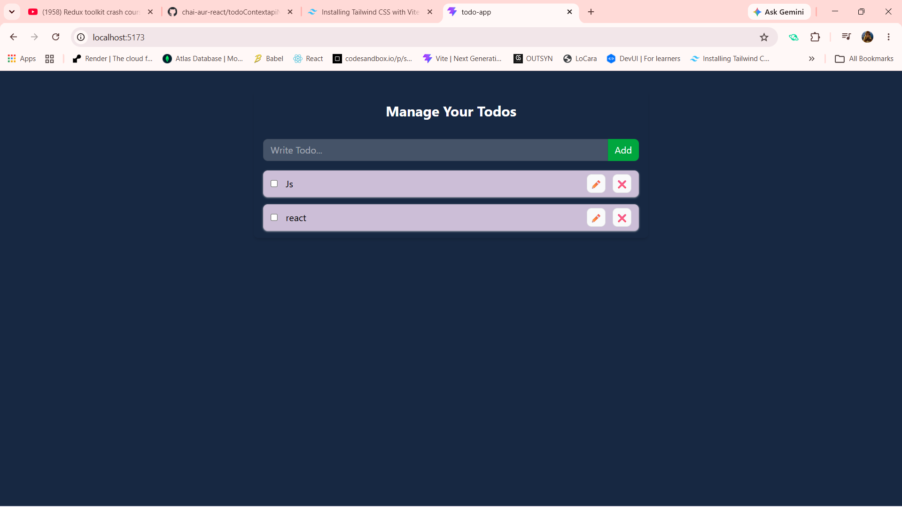

# 📝 Todo App

A simple Todo application built with **React**, **Vite**, and the **Context API**. This project helped me understand how to manage global state and store data in the browser using Local Storage.

## 🚀 Features

- Add new todos
- Edit existing todos
- Mark todos as completed
- Delete todos
- Automatically save todos using Local Storage
- Todos remain available even after refreshing the page

## 🛠️ Technologies Used

- React
- Vite
- Context API
- JavaScript (ES6+)
- Tailwind CSS
- Local Storage

## 📂 Project Structure

```
src/
│── components/
│   ├── TodoForm.jsx
│   └── TodoItems.jsx
│
│── context/
│   └── TodoContext.js
│
│── App.jsx
│── main.jsx
```

## ▶️ Getting Started

### Install dependencies

```bash
npm install
```

### Start the development server

```bash
npm run dev
```

Open the URL shown in your terminal (usually **http://localhost:5173**).

## 💡 What I Learned

While building this project, I practiced:

- Creating reusable React components
- Managing global state with the Context API
- Using `useState` and `useEffect`
- Updating arrays of objects immutably
- Persisting application data with Local Storage
- Building CRUD functionality (Create, Read, Update, Delete)

## 📌 Future Improvements

- Search todos
- Filter by Completed / Pending
- Add due dates
- Drag and drop to reorder todos
- Dark mode

## 📸 Preview



---

This project was built as part of my React learning journey to strengthen my understanding of the Context API, state management, and Local Storage.